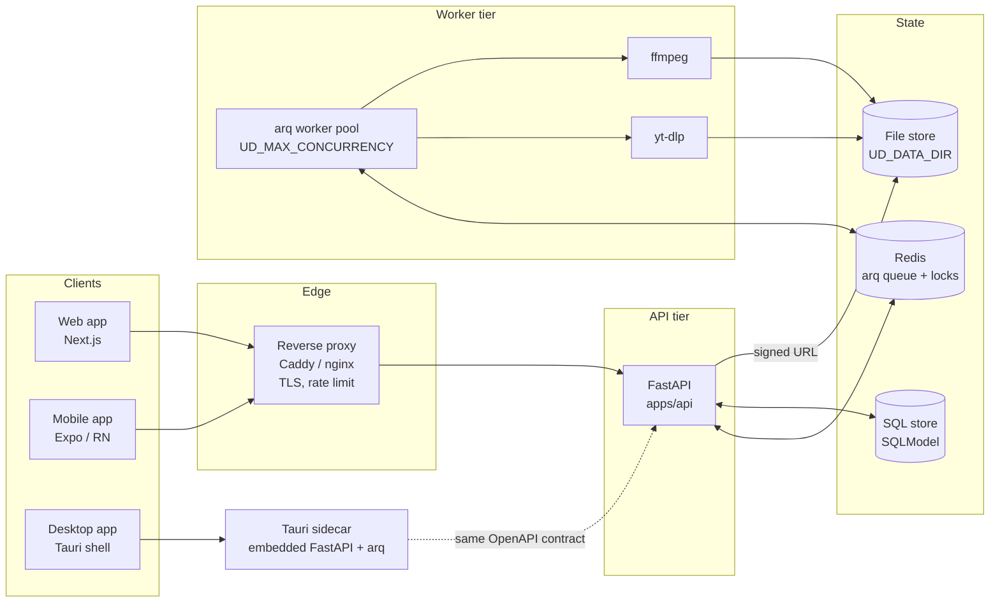
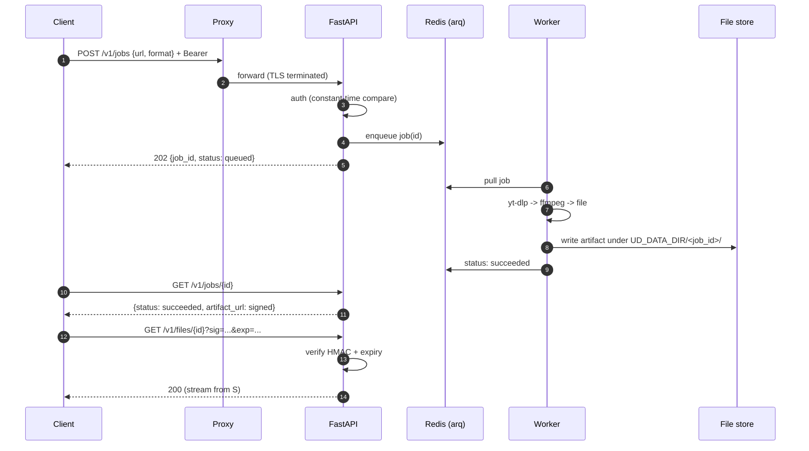
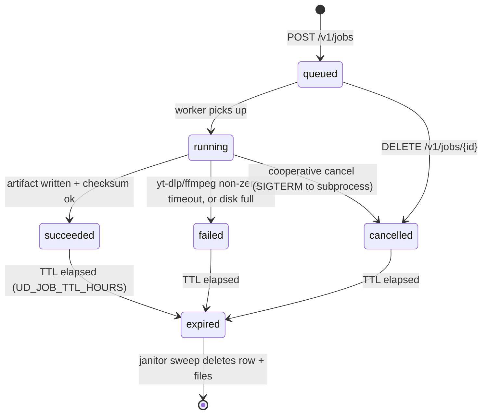

# Architecture

This document describes the Universal Downloader system: the components, how
data flows through them, the lifecycle of a download job, and the security
model that protects both the API and the artifacts it produces.

> **Env name note.** This document uses the `UD_*` variables as defined in
> [`apps/api/app/settings.py`](../apps/api/app/settings.py). Where the ops
> spec referenced names like `UD_DOWNLOAD_DIR` or `UD_FILE_TTL_HOURS`, the
> actual variables are `UD_DATA_DIR` and `UD_JOB_TTL_HOURS`. `UD_SIGNED_URL_SECRET`
> is reserved for the signed-URL feature and falls back to a value derived
> from `UD_API_KEY` via HKDF when not explicitly set.

---

## 1. Components



### Tier breakdown

| Tier      | Component                       | Responsibility |
|-----------|---------------------------------|----------------|
| Client    | Web (Next.js), Mobile (Expo), Desktop (Tauri) | Submit URLs, poll job status, download artifacts via signed URLs. |
| Edge      | Caddy or nginx                  | TLS termination, HTTP/2, rate limiting, optional auth header injection. |
| API       | FastAPI (`apps/api/app/main.py`) | REST endpoints under `/v1/*`, bearer auth, enqueues jobs, signs URLs. |
| Worker    | arq workers + yt-dlp + ffmpeg   | Long-running download/transcode tasks; concurrency controlled by `UD_MAX_CONCURRENCY`. |
| State     | Redis, SQL DB, file store       | Queue/coordination, metadata, artifact bytes. |
| Desktop   | Tauri sidecar                   | Runs the same FastAPI + arq binary in-process for offline/local-first use; speaks the same OpenAPI contract so the web client code is reusable. |

---

## 2. Data flow



---

## 3. Job state machine



States are persisted in the SQL store. Transitions are append-only via a
single `update_status(job_id, new_state)` helper to keep the audit trail
consistent.

---

## 4. Security model

### 4.1 API key

* Single shared bearer token in `UD_API_KEY`, required at startup
  (the app refuses to boot without it — see `settings.py:22`).
* Verified in `apps/api/app/security.py` using `hmac.compare_digest` to
  defeat timing oracles.
* Public, no-auth paths are explicitly enumerated in `PUBLIC_PATHS`
  (`/v1/health`, `/openapi.json`, `/docs`, `/redoc`). Every other route
  requires a valid bearer.

### 4.2 Signed file URLs (HKDF)

Direct artifact downloads do **not** require the bearer; instead the API
issues short-lived signed URLs of the form:

```
GET /v1/files/{job_id}/{filename}?exp=<unix_ts>&sig=<hex>
```

* A per-deployment signing key is derived with **HKDF-SHA256**:
  ```
  HKDF(ikm=UD_SIGNED_URL_SECRET || HKDF(UD_API_KEY, "ud-fallback"),
       salt="ud/signed-url/v1",
       info="file-download")
  ```
* `sig = HMAC-SHA256(key, f"{job_id}\n{filename}\n{exp}")`, hex-encoded.
* Verification: constant-time compare and `exp > now`.
* Default expiry: 5 minutes (configurable per-issue, hard cap = `UD_JOB_TTL_HOURS`).

### 4.3 No auth-bypass policy

* Auth is enforced as a FastAPI dependency at the router level, not via
  middleware that can be reordered accidentally.
* `PUBLIC_PATHS` is a `frozenset` and reviewed in code review.
* Adding a route requires either (a) including the `require_api_key`
  dependency, or (b) explicit signed-URL verification. There is no
  third option.

---

## 5. TTL and cleanup

| Concern          | Mechanism                                                  |
|------------------|------------------------------------------------------------|
| Artifact TTL     | `UD_JOB_TTL_HOURS` (default 24). Janitor task runs hourly. |
| Janitor          | arq cron job: scans DB for `created_at < now - TTL`, deletes files under `UD_DATA_DIR/<job_id>/`, then deletes the row. |
| Orphan files     | Secondary sweep: list `UD_DATA_DIR/*`, for each dir id not in DB, delete. |
| Redis            | arq job results TTL aligned with `UD_JOB_TTL_HOURS`.       |
| Disk pressure    | If free space < 10%, new `POST /v1/jobs` returns `503` and the janitor runs immediately. |
| Crash safety     | Deletes are best-effort; the next sweep retries.           |

Cleanup is idempotent. Stopping the worker mid-sweep is safe.
